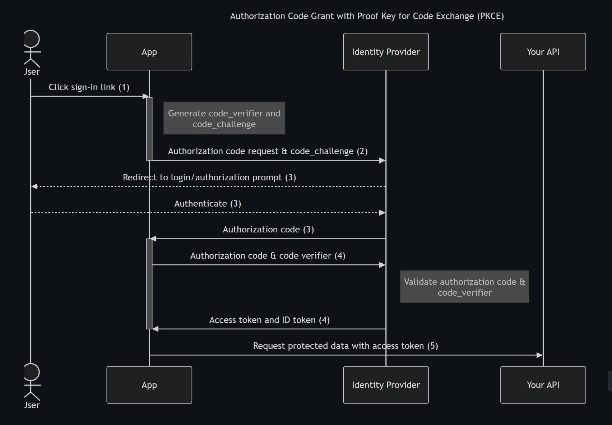

# Aixacla

A **product management** platform built using ASP.NET Core MVC and Angular, designed for seamless integration and scalability. This repository includes templates and scripts to get started with development quickly.

---

## Features

- ASP.NET Core MVC (using .NET 8.0) for robust backend functionality.
- Angular frontend for dynamic, responsive UI.
- Preconfigured project structure for streamlined setup.
- Compatibility with Visual Studio Community 2022.
- Integrated development commands for ease of use.

---

## Prerequisites

Ensure the following tools are installed:

1. **Visual Studio Community 2022**  
   - Workloads: `.NET Desktop Development` and `ASP.NET and web development`

2. **Node.js and npm**  
   - Required for the Angular frontend (verify with `node -v` and `npm -v`).

---


## Getting Started

Follow these steps to set up and run the project:

### 1. Clone the Repository
```bash
git clone <your-repo-url> Aixacla
cd Aixacla


product  management functionality.

dotnet new sln -n 'Aixacla'

Angular Template Project VS Community 2022
<Project Sdk="Microsoft.VisualStudio.JavaScript.Sdk/1.0.1738743">
  <PropertyGroup>
    <StartupCommand>npm start</StartupCommand>
    <JavaScriptTestFramework>Jasmine</JavaScriptTestFramework>
    <!-- Allows the build (or compile) script located on package.json to run on Build -->
    <ShouldRunBuildScript>false</ShouldRunBuildScript>
    <!-- Folder where production build objects will be placed -->
    <BuildOutputFolder>$(MSBuildProjectDirectory)\dist\combust\browser\</BuildOutputFolder>
  </PropertyGroup>
</Project>

aspnetcore MVC template Project VS Community 2022
<Project Sdk="Microsoft.NET.Sdk.Web">

  <PropertyGroup>
    <TargetFramework>net8.0</TargetFramework>
    <Nullable>enable</Nullable>
    <ImplicitUsings>enable</ImplicitUsings>
  </PropertyGroup>

</Project>

Open Solution File in Visual Studio Community 2022.

Run The Solution.

Execute (npm install) in combust npm package.json folder.
Execute (npm run start)
